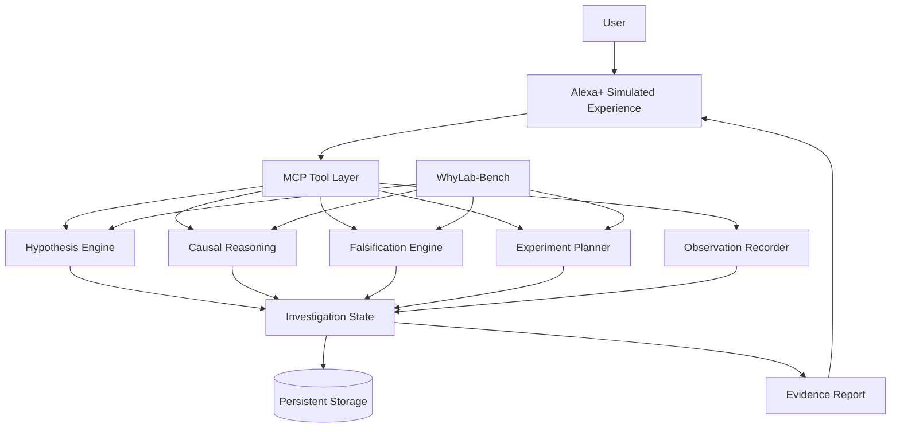

# WhyLab

> **Alexa should not just answer "why?" — it should help you find out.**

**WhyLab** is a persistent scientific-reasoning agent for the **Alexa+ track of the Amazon Developer Hackathon 2026**. Instead of responding to real-world questions with a single generated answer, WhyLab helps users investigate them through competing hypotheses, falsifiable predictions, controlled tests, evidence tracking, and belief revision across multiple sessions.

> **Status:** Early development — v0.1 specification and architecture phase.

---

## The Problem

Modern AI assistants are optimized to produce an answer quickly.

But many real-world questions cannot be answered responsibly from a single prompt:

- Why is my plant wilting?
- Why did this recipe fail?
- Why does this machine make a noise only under certain conditions?
- Why does an outcome keep changing despite the same intervention?

A useful assistant should sometimes say:

> **"We don't know yet. Here is how we can find out."**

WhyLab is built around that idea.

---

## What Makes WhyLab Different

A conventional assistant follows:

```text
Question → Answer
```

WhyLab follows:

```text
Question
   ↓
Competing hypotheses
   ↓
Predictions
   ↓
Potential confounders
   ↓
Falsification conditions
   ↓
Discriminating test
   ↓
Real-world observation
   ↓
Evidence update
   ↓
Next best test
   ↓
Supported / contradicted / unresolved conclusion
```

The product is not merely the conversation.

**The product is the investigation loop.**

---

## Core Principle: Falsification First

WhyLab does not only ask:

> What evidence supports this explanation?

It also asks:

> **What observation would make this explanation less plausible?**

Each serious hypothesis is designed to track:

- predictions;
- evidence for;
- evidence against;
- possible confounders;
- falsification conditions;
- unresolved uncertainty.

WhyLab is designed to change its conclusion when the evidence changes.

---

## Epistemic Contract

WhyLab separates conclusions into three states:

### KNOWN

The available evidence or an explicitly defined rule establishes the claim.

### SUPPORTED

Current evidence favors the explanation, but uncertainty remains.

### OPEN

The available evidence cannot yet distinguish competing explanations.

WhyLab should never present a merely plausible explanation as established fact.

---

## v0.1 Demonstration

The first end-to-end investigation is deliberately narrow:

> **"My basil keeps wilting even though I'm watering it. Help me figure out why."**

WhyLab should:

1. formulate competing hypotheses;
2. identify relevant variables;
3. detect possible confounders;
4. determine what each hypothesis predicts;
5. identify evidence that could falsify each hypothesis;
6. propose a simple discriminating test;
7. persist the investigation;
8. accept a later observation;
9. update the evidence state;
10. recommend the next useful test;
11. explain what is supported, weakened, and still unresolved.

The goal is to make **one investigation exceptional before expanding scope**.

---

## Why Alexa+

WhyLab is designed around interactions that happen while the user is doing something in the real world.

A user might report:

> "The soil is still wet, and two more leaves turned yellow."

without stopping to open a conventional application.

Alexa+ provides a natural interface for:

- hands-free observations;
- longitudinal investigations;
- conversational follow-ups;
- persistent context;
- short, glanceable evidence summaries.

The Alexa+ experience will be demonstrated through a web-based simulated interface backed by real WhyLab tools.

---

## Planned Architecture



The language model serves primarily as the **conversational interface and interpretation layer**.

Structured tools and deterministic components maintain investigation state, validate evidence transitions, execute causal operations where possible, and provide independently testable behavior.

---

## Planned MCP Tools

WhyLab's initial tool surface will include:

```text
create_investigation
formulate_hypotheses
identify_variables
identify_confounders
generate_predictions
generate_falsifiers
design_discriminating_test
record_observation
update_evidence
recommend_next_test
generate_evidence_report
```

Each tool will have one clear responsibility and structured, testable inputs and outputs.

---

## WhyLab-Bench

WhyLab will include an evaluation suite using synthetic causal scenarios with known ground truth.

Planned evaluation dimensions include:

- confounder detection;
- prediction correctness;
- test/intervention validity;
- falsifier identification;
- evidence updating;
- unsupported causal claim rate;
- tool-selection correctness;
- multi-session consistency.

The intended comparison is:

```text
LLM-only baseline
        vs.
WhyLab structured workflow
```

Results will be reported as measured, including negative results.

---

## Development Philosophy

WhyLab follows four rules:

**1. Depth over feature count.**  
A smaller coherent product is preferable to a large collection of unfinished features.

**2. Everything demonstrated must be real.**  
No simulated tool calls, fabricated benchmarks, or decorative functionality.

**3. Evaluation over claims.**  
If we claim the structured workflow improves reasoning, we should measure it.

**4. Investigate rather than merely answer.**  
Every feature must strengthen the scientific investigation loop.

---

## Development Stack

The planned stack includes:

- **Python** — reasoning engine and backend
- **FastAPI** — application API
- **Model Context Protocol (MCP)** — agent tool interface
- **SQLite** — initial persistent investigation state
- **React / TypeScript** — simulated Alexa+ experience
- **Modal** — remote compute, inference, benchmarking, and deployment
- **GitHub** — version control and reproducibility
- **Codex Cloud** — assisted implementation, testing, and code review

Heavy compute and model inference are intended to run remotely rather than on the development laptop.

---

## Repository

```text
WhyLab/
├── docs/
│   ├── WHYLAB_SPEC_V0.1.md
│   └── COMPETITION_STRATEGY.md
├── README.md
└── .gitignore
```

The structure will expand as implementation begins.

---

## Roadmap

- [x] Define product thesis
- [x] Define competition strategy
- [x] Define v0.1 specification
- [ ] Implement investigation state model
- [ ] Implement hypothesis and evidence models
- [ ] Implement falsification engine
- [ ] Implement discriminating-test planner
- [ ] Add persistence
- [ ] Expose MCP tools
- [ ] Build Alexa+ simulation
- [ ] Build WhyLab-Bench
- [ ] Run baseline evaluations
- [ ] Polish three-minute demo
- [ ] Prepare final hackathon submission

---

## Documentation

Detailed project decisions live in:

- [`docs/WHYLAB_SPEC_V0.1.md`](docs/WHYLAB_SPEC_V0.1.md) — product and engineering specification
- [`docs/COMPETITION_STRATEGY.md`](docs/COMPETITION_STRATEGY.md) — scope and competition strategy

---

## Amazon Developer Hackathon 2026

WhyLab is being developed for the **Alexa+ primary track** of the Amazon Developer Hackathon 2026.

The project is currently under active development.

---

## Guiding Question

Before adding a feature, we ask:

> **Does this help WhyLab investigate rather than merely answer?**

If not, it probably does not belong in WhyLab.
