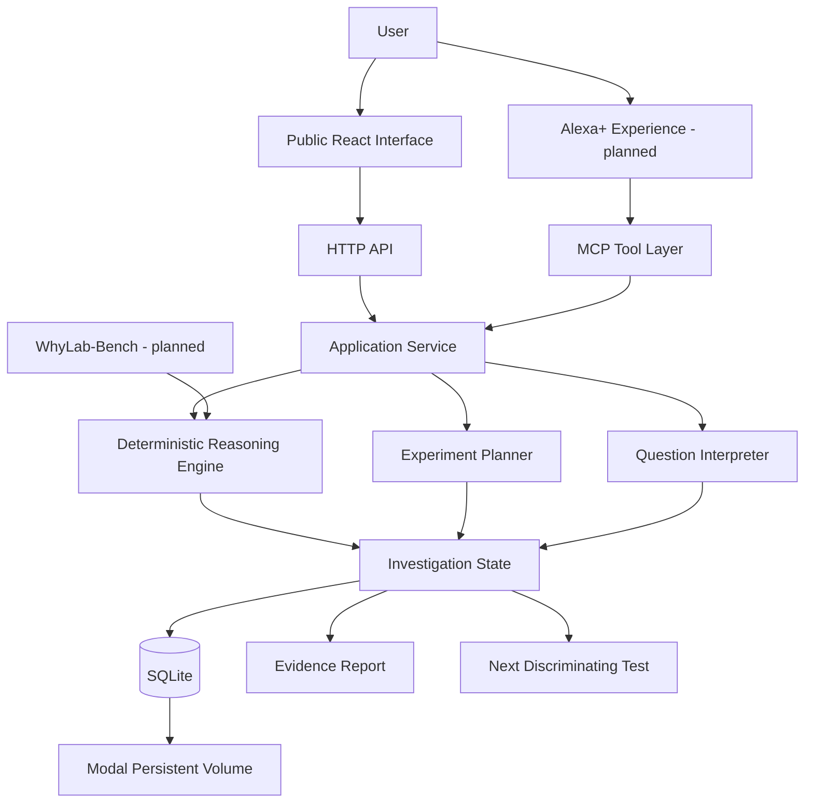

# WhyLab

> **Alexa should not just answer "why?" — it should help you find out.**

**WhyLab** is a persistent scientific-reasoning agent being built for the **Alexa+ track of the Amazon Developer Hackathon 2026**.

Instead of responding to real-world questions with a single generated explanation, WhyLab helps users investigate them through competing hypotheses, falsifiable predictions, observations, deterministic evidence updates, and discriminating follow-up experiments.

> **Status:** Working v0.1 production system — public React interface, persistent HTTP API, and MCP service deployed together on Modal, with the end-to-end basil investigation functioning live.

## Live Demo

**Public app:** https://groldotieno97--whylab-mcp-mcp-app.modal.run

**MCP endpoint:** https://groldotieno97--whylab-mcp-mcp-app.modal.run/mcp

---

## The Problem

Modern AI assistants are optimized to produce answers quickly.

But many real-world questions cannot be answered responsibly from a single prompt:

- Why is my plant wilting?
- Why did this recipe fail?
- Why does this machine make a noise only under certain conditions?
- Why does an outcome keep changing despite the same intervention?

Sometimes the scientifically responsible response is:

> **"We don't know yet. Here is how we can find out."**

WhyLab is built around that idea.

---

## The Investigation Loop

A conventional assistant often follows:

```text
Question → Answer
```

WhyLab follows:

```text
Question
   ↓
Competing hypotheses
   ↓
Predictions and falsifiers
   ↓
Possible confounders
   ↓
Real-world observation
   ↓
Deterministic evidence update
   ↓
Evidence report
   ↓
Next discriminating experiment
   ↓
New observation
   ↓
Revised investigation state
```

The product is not merely the conversation.

**The product is the investigation loop.**

---

## Epistemic Contract

WhyLab separates evidence state from conversational fluency.

A language model or interpreter may propose hypotheses, but it does **not** directly decide that a hypothesis has been established by evidence.

WhyLab currently tracks four states:

### OPEN

The available evidence does not yet distinguish the hypothesis sufficiently.

### SUPPORTED

Current evidence favors the hypothesis, but uncertainty remains.

### CONTRADICTED

Current evidence conflicts with a prediction or falsification condition associated with the hypothesis.

### KNOWN

Reserved for claims established by an explicitly justified rule or sufficiently strong evidence process.

WhyLab v0.1 does **not** automatically assign `KNOWN`.

---

## v0.1 Demonstration

The first end-to-end investigation is deliberately narrow:

> **"My basil keeps wilting even though I'm watering it. Help me figure out why."**

WhyLab creates three competing hypotheses:

```text
H1 — The plant is underwatered
H2 — Excess water is causing root stress
H3 — The plant is receiving insufficient light
```

All begin as:

```text
OPEN
```

If the user later reports:

```text
soil_moisture = 67 percent
```

the deterministic evidence engine updates the investigation to:

```text
H1 → CONTRADICTED
H2 → SUPPORTED
H3 → OPEN
```

WhyLab then recommends a discriminating experiment:

```text
Change:
    drainage

Hold constant:
    watering amount
    light exposure

Compare:
    H2 vs H3

Observe:
    soil moisture
    wilting severity
    drainage behavior

Duration:
    3 days
```

This entire flow is currently implemented and works through both the public browser interface and the deployed MCP service.

---

## Why Alexa+

WhyLab is designed for investigations that unfold while someone is interacting with the physical world.

A user could say:

> "The soil is still wet, and the basil is still wilting."

without stopping what they are doing to fill out a conventional application.

An Alexa+ experience is a natural interface for:

- hands-free observations;
- multi-day investigations;
- conversational follow-ups;
- persistent investigation state;
- short evidence summaries;
- guidance toward the next useful experiment.

The current public browser experience demonstrates the real investigation loop end-to-end. An Alexa+-style conversational layer is planned on top of the same WhyLab reasoning tools.

---

## Current Architecture



The language-model boundary is deliberately separated from the evidence-state machinery.

Interpretation may propose structure.

**Evidence transitions remain explicit and testable.**

---

## MCP Tool Surface

WhyLab currently exposes four MCP tools:

```text
start_investigation
record_observation
get_evidence_report
get_next_test
```

### `start_investigation`

Creates a persistent investigation from a natural-language question.

### `record_observation`

Records a real-world observation and applies deterministic evidence rules.

### `get_evidence_report`

Returns hypotheses grouped by their current evidence state.

### `get_next_test`

Recommends the next experiment intended to discriminate between remaining explanations.

---

## Persistence

WhyLab stores complete investigation state in SQLite.

The production deployment mounts that database on a persistent Modal Volume.

Persistence has been verified across:

```text
MCP request
    ↓
database write
    ↓
Modal Volume commit
    ↓
container termination
    ↓
fresh Modal container
    ↓
investigation restored
```

The basil investigation retained its observation and evidence state after a full Modal container recreation.

---

## Deployment

WhyLab is deployed on **Modal** as one production ASGI application serving the public React frontend, persistent HTTP API, and Streamable HTTP MCP endpoint.

The deployment configuration:

- uses Python 3.12;
- packages the built React frontend into the Modal image;
- keeps DNS-rebinding protection enabled;
- explicitly trusts the production Modal hostname;
- limits the deployment to one container;
- processes one concurrent MCP input;
- persists SQLite state on a Modal Volume;
- commits state after writes.

The production MCP service has been verified remotely using the official Python MCP client, and the public browser investigation flow has been exercised against the same live deployment.

---

## Reproducible Live Smoke Test

The repository includes a production smoke test:

```text
scripts/live_mcp_smoke.py
```

It verifies the deployed service end-to-end:

```text
server connection
    ↓
tool discovery
    ↓
start investigation
    ↓
record soil-moisture observation
    ↓
verify evidence-state transition
    ↓
generate evidence report
    ↓
recommend discriminating experiment
```

Run it with:

```bash
python scripts/live_mcp_smoke.py \
  --url <STREAMABLE_HTTP_MCP_URL>
```

A successful run reports:

```text
PASS: live server exposes the four WhyLab tools
PASS: investigation starts with all hypotheses open
PASS: deterministic evidence update is correct
PASS: evidence report is correct
PASS: next discriminating experiment is correct

WhyLab live MCP smoke test PASSED
```

---

## Local Development

WhyLab uses Python 3.12 and `uv`.

Install dependencies:

```bash
uv sync
```

Run the test suite:

```bash
uv run pytest -q
```

Run the MCP server locally over stdio:

```bash
uv run whylab-mcp
```

Run it locally with Streamable HTTP:

```bash
WHYLAB_MCP_TRANSPORT=streamable-http \
WHYLAB_MCP_HOST=127.0.0.1 \
WHYLAB_MCP_PORT=8765 \
uv run whylab-mcp
```

---

## Project Structure

```text
WhyLab/
├── docs/
├── frontend/
│   ├── src/
│   └── vite.config.ts
├── scripts/
│   └── live_mcp_smoke.py
├── src/
│   └── whylab/
│       ├── api/
│       ├── application/
│       ├── deploy/
│       ├── domain/
│       ├── interpreters/
│       ├── mcp/
│       ├── reasoning/
│       ├── storage/
│       └── tools/
├── tests/
├── pyproject.toml
└── README.md
```

---

## WhyLab-Bench

A structured evaluation suite is planned to test whether the WhyLab workflow improves scientific reasoning relative to a less structured baseline.

Candidate dimensions include:

- confounder identification;
- prediction correctness;
- falsifier identification;
- intervention quality;
- evidence updating;
- unsupported causal claims;
- tool-selection correctness;
- multi-session consistency.

The intended comparison is:

```text
LLM-only baseline
        vs.
WhyLab structured workflow
```

Results will be reported as measured, including negative results.

---

## Development Principles

**1. Depth over feature count.**
One exceptional investigation is more valuable than many shallow demos.

**2. Everything demonstrated must be real.**
No simulated tool calls, fabricated benchmarks, or decorative functionality.

**3. Evaluation over claims.**
If WhyLab claims to improve reasoning, that improvement should be measurable.

**4. Falsification matters.**
A hypothesis should include not only supporting predictions, but also conditions that would count against it.

**5. Evidence state is not generated prose.**
Interpretation and conversation may use models; scientific state transitions remain independently testable.

**6. Persistence is part of the product.**
An investigation should survive beyond a single conversation or runtime instance.

---

## Current Stack

- **Python 3.12**
- **Pydantic**
- **FastAPI**
- **Model Context Protocol (MCP)**
- **SQLite**
- **TypeScript**
- **React**
- **Vite**
- **Modal**
- **pytest**
- **uv**
- **GitHub**

The public React interface is live. The next interface milestone is the Alexa+-style conversational demonstration backed by the same real investigation tools and persistent state.

---

## Competition Goal

WhyLab is being built around one central proposition:

> **An AI assistant should not merely generate explanations. It should help a person conduct a better investigation.**

The v0.1 basil workflow is the first proof of that idea.
